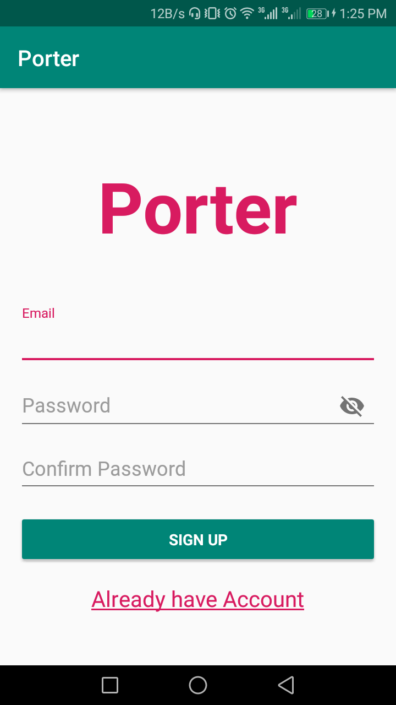

# Porter- Android App
It's implmentation of Firebase Authentication, Firebase Realtime-Database, PieChart & Barcode Scanner.

## Screenshots

## Permissions
- Network.
- Access Network State.
- Camera.

## Third-party Libraries
-<a href="https://github.com/Karumi/Dexter">Dexter</a> :- used for permissions at runtime.

-<a href="https://github.com/dm77/barcodescanner">BarcodeScanner</a> :- used for scannig barcodes based on ZXing.

-<a href="https://github.com/PhilJay/MPAndroidChart">MPAndroidChart</a> :- used for draw PieChart gragh view.

## Firebase
-<a href="https://firebase.google.com/docs/auth/">Firebase Authentication</a> :- used email & password Authentication for login and register.

-<a href="https://firebase.google.com/docs/database/">Firebase Real-time Database</a> :- used as Online Database.
